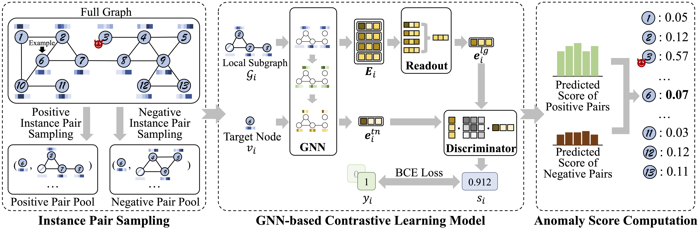

# Anomaly Detection on Attributed Networks via Contrastive Self-Supervised Learning (TNNLS 2021)

This is the source code of TNNLS paper [Anomaly Detection on Attributed Networks via Contrastive Self-Supervised Learning](https://arxiv.org/abs/2103.00113) (CoLA). 




## Requirments
This code requires the following:
* Python>=3.7
* PyTorch>=1.8.1
* Numpy>=1.19.2
* Scipy>=1.6.2
* Scikit-learn>=0.24.1
* Networkx>=2.5.1
* Tqdm>=4.59.0
* DGL==0.4.0 (Do not use the version which is newer than that!)

## Running the experiments
### Step 1: Anomaly Injection
This is a pre-processing step which injects anomalies into the original clean datasets. Take Cora dataset as an example:
```
python inject_anomaly.py --dataset cora
```

After anomaly injection, the disturbed datasets are saved into "dataset" folder.

Note that the disturbed ACM dataset is directly borrowed from the code of [DOMINANT](https://github.com/kaize0409/GCN_AnomalyDetection) and do not need injection. 

### Step 2: Anomaly Detection
This step is to run the CoLA framework to detect anomalies in the network datasets. Take Cora dataset as an example:
```
python run.py --dataset cora
```
The hyperparameters are set to be the values reported in [our paper](https://arxiv.org/abs/2103.00113). 
You can change the default values of other parameters to simulate different conditions. 

## Cite

If you compare with, build on, or use aspects of CoLA framework, please cite the following:
```
@article{liu2021anomaly,
  title={Anomaly Detection on Attributed Networks via Contrastive Self-Supervised Learning},
  author={Liu, Yixin and Li, Zhao and Pan, Shirui and Gong, Chen and Zhou, Chuan and Karypis, George},
  journal={IEEE Transactions on Neural Networks and Learning Systems},
  year={2021},
  publisher={IEEE}
}
```